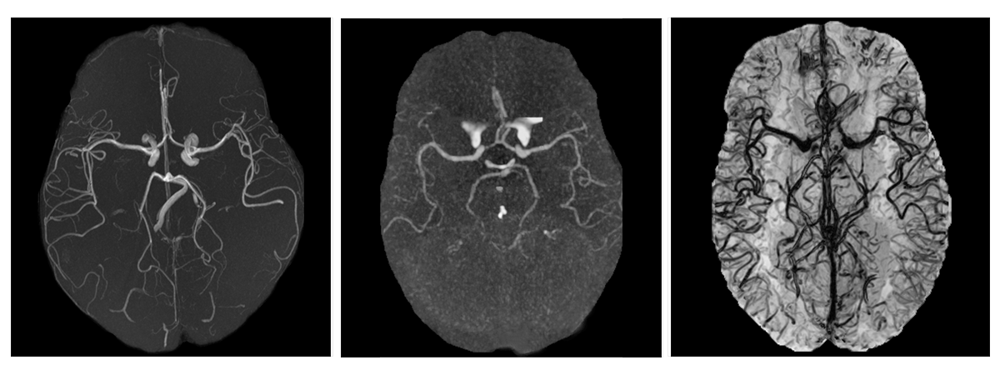

## MultiVesSeg &mdash; Official PyTorch Implementation


**Picture:** *Maximum intensity projection (MIP) of a magnetic resonance angiography (left), MIP of a computed tomography angiography (center), and minimum intensity projection (mIP) of a magnetic resonance venography (right). All images are skull-stripped and viewed from the axial perspective.*

This repository contains the official PyTorch implementation of the following paper:

> **Multi-Domain Brain Vessel Segmentation Through Feature Disentanglement**<br>
> Francesco Galati, Rosa Cortese, Ferran Prados, Ninon Burgos, Maria A. Zuluaga<br>
> Under review
>
> **Abstract:** *The intricate morphology of brain vessels poses significant challenges for automatic segmentation models, which usually focus on a single imaging modality. However, accurately treating brain-related conditions requires a comprehensive understanding of the cerebrovascular tree regardless of the specific acquisition procedure. Through image-to-image translation, our framework effectively segments brain arteries and veins in various datasets, while avoiding domain-specific model design and data harmonization between the source and the target domain. This is accomplished by employing disentanglement techniques to independently manipulate different image properties, allowing to move from one domain to the other in a label-preserving manner. Specifically, we focus on the manipulation of vessel appearances during adaptation, while preserving spatial information such as shapes and locations, which are crucial for correct segmentation. Our evaluation demonstrates efficacy in bridging large and varied domain gaps across different medical centers, image modalities, and vessel types. Additionally, we conduct ablation studies on the optimal number of required annotations and other architectural choices. The results obtained highlight the robustness and versatility of our framework, demonstrating the potential of domain adaptation methodologies to perform cerebrovascular image segmentation accurately in multiple scenarios.*

## System requirements
- batchgenerators==0.24
- evalutils==0.4.2
- matplotlib==3.5.2
- MedPy==0.4.0
- nibabel==4.0.1
- nilearn==0.10.3
- opencv-python==4.6.0.66
- pytorch-msssim==0.2.1
- scikit-image==0.19.3
- SimpleITK==2.1.1.2
- tensorboard==2.9.1
- torch==1.9.1+cu111

## Preparing datasets for training

Folder `preprocessing` contains the Jupyter notebooks used to prepare the datasets utilized in our experiments: OASIS tocite, IXI tocite, and TopCow tocite. To preprocess your own dataset, create a new notebook by following the structure of the existing ones.

## Training networks

### Phase 1

### Phase 2
TODO:download pretrained models, add pretraining

Once the pretraining is complete, you can move to the target dataset:

1) Split the preprocessed target data into `labeled` and `unlabeled`.
```
mkdir ${TGT_dir}/train/labeled
mkdir ${TGT_dir}/train/unlabeled
mv ${TGT_dir}/train/*.npy ${TGT_dir}/train/unlabeled
mv ${TGT_dir}/train/unlabeled/${ID_1}_slice* ${TGT_dir}/train/labeled
mv ${TGT_dir}/train/unlabeled/${ID_2}_slice* ${TGT_dir}/train/labeled
mv ${TGT_dir}/train/unlabeled/${ID_3}_slice* ${TGT_dir}/train/labeled
```

2) Edit the configuration files `data_configs.py` and `paths_config.py`  inside folder `configs_train`.

3) Start the training script.
```
python train.py --dataset_type=HQSWI --exp_dir=${tgt_dir} --workers=6 --batch_size=4 --test_batch_size=8 --test_workers=6 --start_from_latent_avg --output_size=512 --input_nc=1 --label_nc=3 --max_steps=${TGT_STEPS} --checkpoint_dir=${src_dir}/checkpoints  --one_target_slice --src_label 0 --tgt_label 1
```

## Running inference

1) Edit the configuration files `data_configs.py` and `paths_config.py`  inside folder `configs_train`.

2) Start the inference script.
```
python scripts/inference.py --dataset_type=HQSWI --exp_dir=${inf_dir} --test_batch_size=8 --test_workers=6 --start_from_latent_avg --output_size=512 --input_nc=1 --label_nc=3 --checkpoint_dir=${tgt_dir}/checkpoints --src_label 0 --tgt_label 1
```
